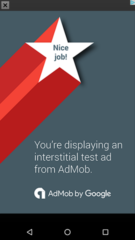

# Build It Bigger
This app showcases a deep learning of the Android build cycle with Gradle.  This app contains four project modules: A Java library that provides jokes, a Google Cloud Endpoint (GCE) module that serves the jokes from the Java library, an Android library containing an activity for displaying the jokes, and an Android app that fetches jokes from the GCE module and passes them to the Android library for display.

This app also provides a free and paid version.  The free version displays Ads from google services ad-mob on the main activity as well as an interstitial ad between activity changes. The paid version contains no ads.

This project contains a connected test to make sure a joke is actually being received from the java library through the GCE.

### google-services.json
Before building the project, you will need to obtain a google-services.json file for this app.  Follow the instructions [here].  
Package names for each client for the json file are as follows:
* com.udacity.gradle.builditbigger.free
* com.udacity.gradle.builditbigger.paid

### Test Ads
The Test Ads for this project is currently setup to run on an emulator.  To run on a device, follow the instructions at the following link:
https://firebase.google.com/docs/admob/android/targeting#test_ads

To create Ad unit Ids for your app to display real ads, follow the instructions at the following link:
https://support.google.com/admob/answer/3052638https://support.google.com/admob/answer/3052638  
**Note: You should always use test ads when developing and testing your app. It is against AdMob policy to click on your own live ads. During development and testing, use test ads.**

### GCE backend test
The backend for this project is only being deployed locally.  To deplay the backend live to App engine and test the backend on a device, follow the instructions at the following link:
https://github.com/GoogleCloudPlatform/gradle-appengine-templates/tree/master/HelloEndpoints

-Free  

-Paid  

-Joke Activity  

   [here]: <https://firebase.google.com/docs/admob/android/quick-start#google-servicesjson>
